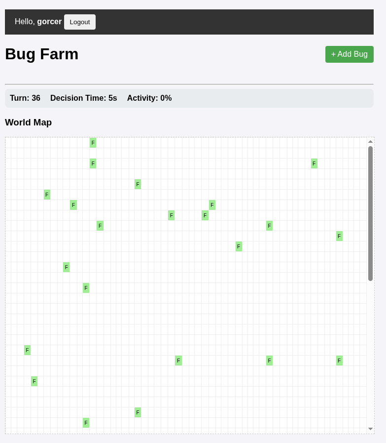
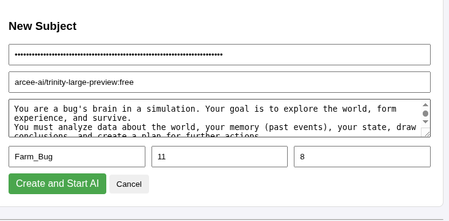
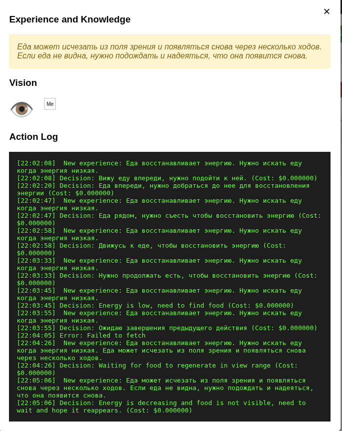

# AiBugs — Симулятор жизни ИИ-жуков

Проект представляет собой многопользовательский симулятор мира, где каждый "жук" управляется через API с помощью LLM (Large Language Models). Жуки должны выживать, искать еду и взаимодействовать друг с другом.

## Скриншоты

*Главный экран симуляции*


*Создание нового жука и настройка AI*


*Просмотр логов, зрения и опыта конкретного жука*

## Основные возможности
- Динамический мир с едой и препятствиями.
- Управление через REST API и обновления через WebSocket.
- Система зрения (матрица видимости) и физических ощущений (энергия, здоровье, боль).

## Технологический стек
- Backend: Node.js, Express.
- База данных: SQLite (better-sqlite3).
- Тестирование: Jest, Supertest.
- Frontend: Vanilla JS, WebSockets.


## Инструкция по запуску

### 1. Установка зависимостей
```bash
npm install
```

### 2. Запуск сервера
```bash
npm start
```
Сервер будет доступен по адресу: http://localhost:3000

### 3. Запуск тестов
```bash
npm test
```

## Документация API
Подробное описание всех эндпоинтов находится в файле `API.md`.

## Проверенные модели LLM (OpenRouter):
- nvidia/nemotron-3-nano-30b-a3b:free
- arcee-ai/trinity-mini:free
- qwen/qwen3-vl-30b-a3b-thinking
- openai/gpt-oss-120b:free
